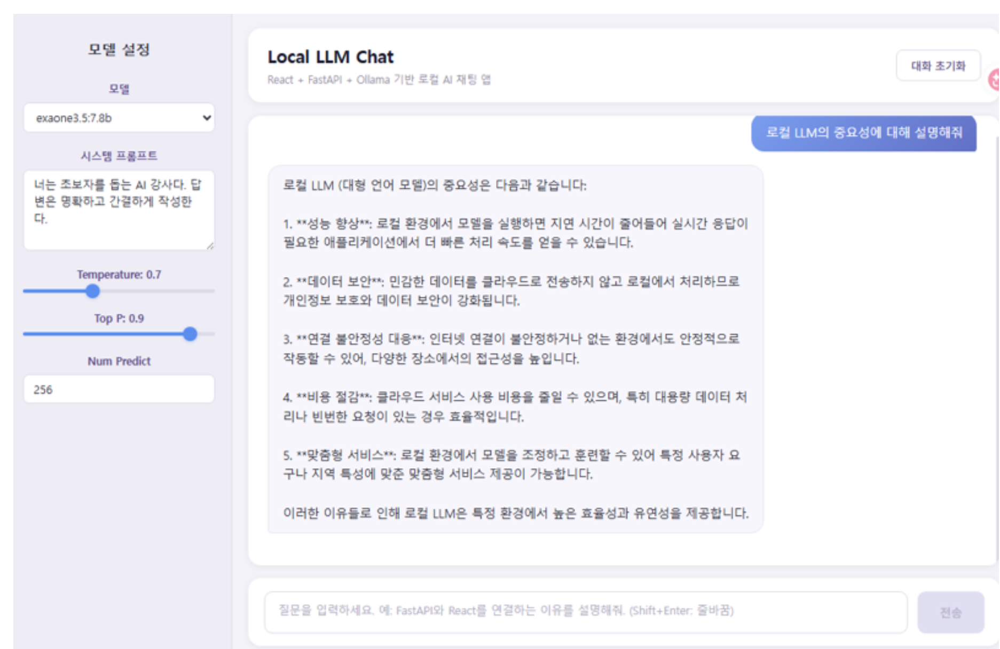

# 화면 UI 설계 내용


# 데이터 실행 흐름도
frontend/docs/image-1.png

# 기본 명령
너는 React 프론트엔드 개발자다.
아래 조건에 맞춰 Vite 기반 React 로컬 LLM 채팅 앱을 구현해줘.
React + Vite 프론트엔드에서 FastAPI /chat API를 axios로 호출하는 채팅 앱을 구현해줘.
React, Vite, fetch 사용 방식은 최신 공식 문서 기준으로 작성해줘.
프론트엔드는 Ollama를 직접 호출하지 않고 FastAPI만 호출해야 해.
use context7

# 기술 조건
- React + Vite
- JavaScript 사용
- TypeScript 사용하지 않음
- CSS는 일반 CSS 사용
- axios로 FastAPI 호출
- 상태관리는 useState만 사용
- API 호출 코드는 src/api/chatApi.js로 분리
- 프롬프트 모드 데이터는 src/api/promptModes.js로 분리

# UI 설계 화면

- docs/image.png 위치의 이미지와 동일한 화면으로 UI를 구성한다.
- 각 기능이 정상적으로 동작되도록 한다.
- 첫 번째 화면에서는 챗팅 화면의 텍스트는 없는 상태로 한다.
- **Apple 수석 디자이너(Jony Ive) 스타일**로 디자인한다. (아래 9절 참고)

---

# 1. 프로젝트 개요
본 프로젝트는 React + FastAPI + Ollama 기반의 로컬 AI 채팅 애플리케이션이다.
사용자는 React 화면에서 질문을 입력하고, FastAPI 백엔드로 요청을 전송한다.
FastAPI는 Ollama API를 호출하여 로컬 언어모델의 응답을 받아오고, React는 응답 결과를 채팅 UI에 표시한다.

---

# 2. 기술 스택

| 구분 | 기술 |
|---|---|
| Frontend | React 19, Vite 8 |
| Language | JavaScript (TypeScript 미사용) |
| Styling | 일반 CSS (CSS 변수 기반 디자인 토큰) |
| API Client | axios |
| Markdown 렌더링 | react-markdown, remark-gfm |
| Backend | FastAPI |
| LLM Runtime | Ollama |

---

# 3. 전체 연동 구조
```
User Browser
  ↓
React Frontend  (http://localhost:5173)
  ↓  axios POST /chat
FastAPI Backend  (http://localhost:8000)
  ↓
Ollama  (http://localhost:11434)
  ↓
Local Language Model
```

**CORS 허용 출처:** `http://localhost:5173`

---

# 4. 프론트엔드 파일 구조
```
frontend/
├── .env                        # 환경변수 (VITE_API_BASE_URL)
├── src/
│   ├── api/
│   │   ├── chatApi.js          # FastAPI 호출 + 전송 전 값 안전 처리
│   │   └── promptModes.js      # 프롬프트 모드 데이터 (5가지)
│   ├── components/
│   │   ├── ChatWindow.jsx      # 메인 채팅 윈도우 (상태·에러 관리)
│   │   ├── ChatWindow.css
│   │   ├── SettingsPanel.jsx   # 좌측 설정 패널 (모델·모드·파라미터)
│   │   ├── SettingsPanel.css
│   │   ├── MessageList.jsx     # 메시지 목록 + 자동 스크롤 + 로딩
│   │   ├── MessageList.css
│   │   ├── MessageBubble.jsx   # 개별 메시지 버블 (Markdown + 복사)
│   │   ├── MessageBubble.css
│   │   ├── ChatInput.jsx       # 입력창 (Shift+Enter 전송)
│   │   └── ChatInput.css
│   ├── App.jsx                 # 앱 진입점 + 전역 상태
│   ├── App.css
│   ├── main.jsx                # React 렌더링
│   └── index.css               # 전역 스타일 + CSS 디자인 토큰
└── docs/
    ├── frontend_spec.md
    ├── image.png
    └── image-1.png
```

---

# 5. 환경변수 (.env)
```
VITE_API_BASE_URL=http://localhost:8000
```

---

# 6. 백엔드 위치 및 API

**위치:** `backend/`  
**실행:** `uvicorn main:app --reload`

| 메서드 | 엔드포인트 | 설명 |
|---|---|---|
| GET | `/models` | Ollama에서 사용 가능한 모델 목록 반환 |
| POST | `/chat` | 사용자 메시지를 LLM에 전달하고 응답 반환 |

### POST /chat 요청 스키마 (ChatRequest)
```json
{
  "message":      "string (필수)",
  "model":        "string (기본: gemma4:e4b)",
  "system_prompt":"string",
  "temperature":  "float  0.0 ~ 2.0 (기본: 0.7)",
  "top_p":        "float  0.0 ~ 1.0 (기본: 0.9)",
  "num_predict":  "int    1 ~ 2048  (기본: 256)"
}
```

### POST /chat 응답 스키마 (ChatResponse)
```json
{
  "model":        "string",
  "message":      "string",
  "elapsed_time": "float (초)"
}
```

---

# 7. SettingsPanel — 설정 항목

좌측 사이드바에 아래 순서로 항목을 배치한다.

| 순서 | 항목 | UI 컴포넌트 | 비고 |
|---|---|---|---|
| 1 | 모델 선택 | `<select>` | `/models` API로 동적 로드 |
| 2 | 프롬프트 모드 | `<select>` | promptModes.js 5가지 모드 |
| 3 | 시스템 프롬프트 | `<textarea>` | 모드 선택 시 자동 반영; 직접 수정 시 "사용자 지정" 표시 |
| 4 | Temperature | range 슬라이더 | 0.0 ~ 2.0, step 0.1 |
| 5 | Top P | range 슬라이더 | 0.0 ~ 1.0, step 0.1 |
| 6 | Num Predict | number input | 1 ~ 2048 |

### 프롬프트 모드 목록 (promptModes.js)
| 키 | 레이블 |
|---|---|
| `basic` | 기본 설명 모드 |
| `teacher` | 강사용 설명 모드 |
| `code` | 코드 멘토 모드 |
| `troubleshoot` | 오류 해결 모드 |
| `table` | 표 형식 정리 모드 |

---

# 8. 기능 명세

### 8-1. 채팅 기능
- 사용자가 입력창에 메시지 입력 후 **Shift+Enter** 또는 **전송 버튼** 클릭으로 전송
- 전송 즉시 사용자 메시지 버블 표시, 로딩 인디케이터(타이핑 닷) 표시
- AI 응답 수신 후 버블 표시, 소요 시간(elapsed_time) 표시
- **대화 초기화** 버튼으로 메시지 목록 초기화

### 8-2. Markdown 렌더링
사용자 메시지·AI 메시지 모두 `react-markdown` + `remark-gfm`으로 렌더링한다.

지원 문법:
- 제목 (h1 ~ h6), 굵게, 기울임, 취소선
- 순서·비순서 리스트, 중첩 리스트
- 인라인 코드, 코드 블록 (언어 표시 포함)
- 인용(blockquote), 수평선
- 링크
- GFM 표 (헤더·바디 구분)
- 체크박스 태스크 리스트

### 8-3. 복사 기능
| 위치 | 복사 대상 | 피드백 |
|---|---|---|
| AI 메시지 버블 우측 상단 | 메시지 전체 텍스트 | 2초간 체크 아이콘 + 초록색 |
| 코드 블록 헤더 우측 | 해당 코드 전체 | 2초간 체크 아이콘 + 초록색 |

### 8-4. 오류 처리
- 서버 422 응답 시 Pydantic 상세 오류를 파싱해 에러 배너에 표시
- 서버 500 응답 시 오류 메시지 에러 배너에 표시
- 에러 배너는 채팅 헤더 바로 아래에 표시

---

# 9. Apple 디자인 시스템

### 디자인 원칙
- **Clarity** — 명확한 타이포그래피 계층, 읽기 쉬운 폰트
- **Deference** — UI가 대화 콘텐츠를 방해하지 않는 절제된 색상
- **Depth** — Frosted Glass 레이어, 섬세한 그림자

### CSS 디자인 토큰 (index.css :root)
```css
--font: -apple-system, BlinkMacSystemFont, 'SF Pro Text', 'Helvetica Neue', sans-serif;

--bg:           #f5f5f7;        /* Apple 라이트 그레이 배경 */
--surface:      #ffffff;
--sidebar-bg:   rgba(255,255,255,0.72);  /* Frosted Glass */

--text-primary:   #1d1d1f;
--text-secondary: #6e6e73;
--text-tertiary:  #aeaeb2;

--accent:         #0071e3;      /* Apple Blue */
--bubble-user:    #0071e3;      /* iMessage 파란색 */
--bubble-ai:      #e9e9eb;      /* iMessage 회색 (AI: surface로 변경) */

--border:         rgba(0,0,0,0.08);
--border-mid:     rgba(0,0,0,0.12);

--shadow-xs: 0 1px 3px rgba(0,0,0,0.06);
--shadow-sm: 0 2px 8px rgba(0,0,0,0.08);

--radius-sm: 8px;
--radius-md: 12px;
--radius-lg: 18px;
--radius-xl: 22px;

--transition: 0.2s cubic-bezier(0.4,0,0.2,1);
```

### 주요 UI 컴포넌트 스타일
| 컴포넌트 | 스타일 |
|---|---|
| 사이드바 | `backdrop-filter: blur(24px) saturate(180%)` Frosted Glass |
| 헤더 / 입력창 | `backdrop-filter: blur(20px)` 반투명 |
| 사용자 버블 | `#0071e3` 파란색, 우측 하단 꼬리 |
| AI 버블 | 흰색 surface + 1px border, 좌측 하단 꼬리 |
| 전송 버튼 | 원형 `#0071e3`, 화살표 SVG 아이콘 |
| 대화 초기화 | 둥근 pill 형태, outline 스타일 |
| 슬라이더 thumb | 흰색 원형, hover 시 파란 glow ring |
| 포커스 링 | `box-shadow: 0 0 0 3px rgba(0,113,227,0.15)` |
| 버블 등장 애니메이션 | `scale(0.94) + translateY(6px)` → 자연스러운 팝인 |

---

# 10. API 호출 안전 처리 (chatApi.js)

전송 직전 값을 방어 처리하여 백엔드 422 오류를 예방한다.

```js
// num_predict: NaN 또는 범위 초과 시 기본값 256 사용
const safeNumPredict = Number.isFinite(num_predict) && num_predict >= 1
  ? Math.floor(num_predict) : 256;

// temperature: 유효하지 않으면 0.7, 범위 [0, 2] 클램프
const safeTemperature = Number.isFinite(temperature)
  ? Math.min(Math.max(temperature, 0), 2) : 0.7;

// top_p: 유효하지 않으면 0.9, 범위 [0, 1] 클램프 (le=1.0 제약 준수)
const safeTopP = Number.isFinite(top_p)
  ? Math.min(Math.max(top_p, 0), 1) : 0.9;
```

슬라이더 onChange에서도 `Math.round(val * 10) / 10`으로 부동소수점 오차를 보정한다.

---

# 11. Context7 MCP 사용 지침
본 프로젝트의 코드 생성, 리팩터링, 오류 수정, 라이브러리 사용법 확인 시 VS Code MCP Servers에 설치된 Context7 MCP를 사용한다.
다음 라이브러리 또는 프레임워크를 사용할 때는 반드시 Context7 MCP로 최신 공식 문서와 코드 예제를 확인한 뒤 구현한다.
- FastAPI, React, Vite, LangChain, Ollama, react-markdown, remark-gfm
